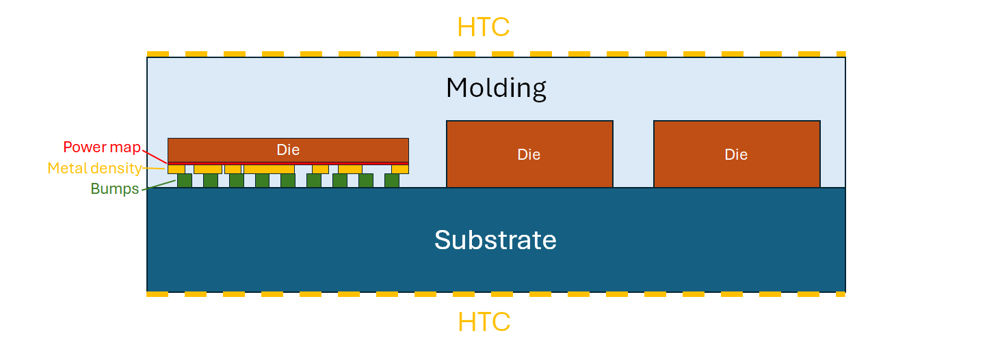

PyEDB金屬密度建立
---
### 範例堆疊

圖片中的堆疊結構(Stackup)從上到下依序為：最上方是封裝樹脂(Molding)，提供物理保護與絕緣；接著內含數個晶片(Die)，其中最左邊的晶片底部具有導熱與導電的凸塊(Bumps)，並透過金屬密度(Metal density)與功耗分佈(Power map)設定，精確呈現晶片內的熱量與導熱特性；最底層為基板(Substrate)，負責支撐晶片並提供電性連接。此外，圖示上下邊界標示的HTC(Heat Transfer Coefficient)表示邊界上設定了對外環境的熱傳條件，供模擬環境熱交換使用



### 利用PyEDB生成10層 100x100 Metal Density

這段程式的主要目的，是使用金屬密度(metal density)的數據，自動產生具有真實結構的EDA設計資料庫(EDB)。首先，程式會從外部檔案metal_density.txt讀取每一層(layer)的金屬密度資訊，接著依據這些資料，在EDB中建立每一層的堆疊結構並設定厚度。每層中再依據密度數值，建立對應位置的金屬方塊與內部空隙(void)。密度高的位置表示金屬多、導熱佳，密度低則金屬少、導熱差。

透過此方式，能精準呈現每個區域的熱導率差異，提供更真實的結構與材料資訊給後續的電磁或熱分析(如Icepak)。此流程自動化產生了包含真實材料特性的幾何結構，避免人為疏忽或繁瑣手動設定所造成的誤差。此外，程式透過Python API直接生成AEDT工具可讀的EDB檔案(chip.aedb)，有助於加速設計流程並提升分析精確度，尤其在高精度或高功率密度的晶片封裝設計中，此方法能提供更貼近實務的模擬基礎，大幅提高後續熱分析與優化設計的效益。

```python
import os
from ansys.aedt.core import Edb
from itertools import product
import math

metal_density = {}
layer_name =''
thickness = ''
dx, dy = 100, 100

with open('c:/demo/metal_density.txt') as f:
    for line in f:
        try:
            values = [float(i) for i in line.split()]
            metal_density[(layer_name, float(thickness))].append(values)
        except:
            layer_name, thickness = line.split()
            metal_density[(layer_name, float(thickness))] = []

edb = Edb(edbversion='2024.1')

total_thickness = 0
for (layer_name, thickness) in metal_density:
    edb.stackup.add_layer(layer_name, method='add_on_bottom', thickness=f'{thickness}um',)
    total_thickness += thickness

for (layer_name, thickness), values in metal_density.items():
    for m, row in enumerate(values):
        for n, density in enumerate(row):
            rect = edb.modeler.create_rectangle(layer_name, 'gnd',
                                                (f'{dx*m}um', f'{dy*n}um'),
                                                (f'{dx*(m+1)}um', f'{dy*(n+1)}um'),)
            ratio = math.sqrt(1-density)
            void = edb.modeler.create_rectangle(layer_name, 'gnd',
                                                (f'{dx*m}um', f'{dy*n}um'),
                                                (f'{dx*(m+ratio)}um', f'{dy*(n+ratio)}um'),)
            edb.modeler.add_void(rect, void)


edb.save_edb_as('c:/demo/chip.aedb')
edb.close_edb()


```

### 3D Layout 載入 chip.aedb

#### 上視圖


#### 側視圖


