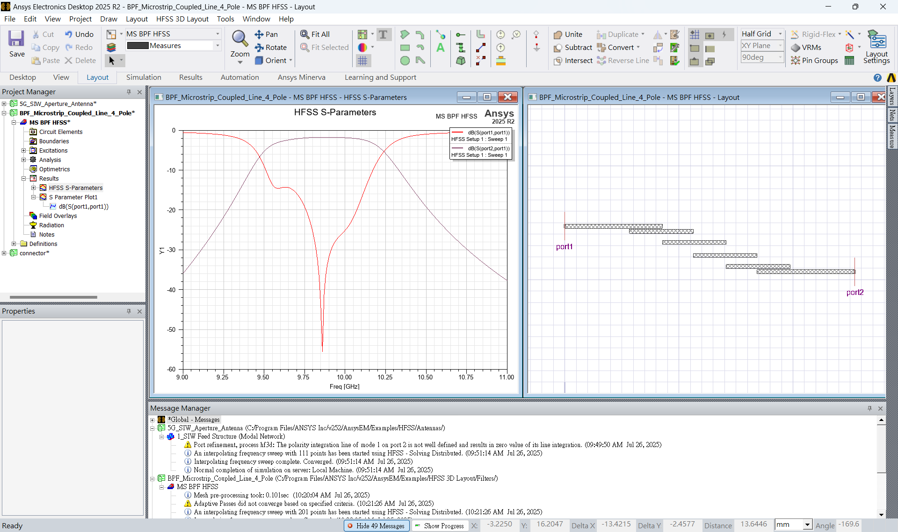

## 3a. BPF圖標示



[檔案下載](assets/BPF%20S-Parameters.csv)
### Prompt
>create python function. plot insertion loss and return loss of BPF, label 3db bandwidth in different color and show bandwidth, show peak x, y, dip x, y of return loss,

### Python
```python
import pandas as pd
import matplotlib.pyplot as plt

def plot_bpf_sparams(csv_path):
    """
    繪製 Bandpass Filter 的插入損耗（S21）與反射損耗（S11），
    標示 3dB 頻寬範圍、S21 peak 點與 S11 dip 點。

    參數：
        csv_path (str): S-parameter CSV 檔案路徑，需含欄位 Freq_GHz, S11_dB, S21_dB。
    """

    # 讀取資料並重新命名欄位（若來源已為簡潔標題可省略）
    df = pd.read_csv(csv_path)
    df.columns = ["Freq_GHz", "S11_dB", "S21_dB"]

    # 計算 S21 peak（最大值）與 3dB 帶寬範圍
    max_s21 = df["S21_dB"].max()
    bw_3db_threshold = max_s21 - 3
    in_band = df[df["S21_dB"] >= bw_3db_threshold]
    bw_start = in_band["Freq_GHz"].iloc[0]
    bw_stop = in_band["Freq_GHz"].iloc[-1]
    bandwidth = bw_stop - bw_start
    peak_freq = df["Freq_GHz"][df["S21_dB"].idxmax()]
    peak_s21 = max_s21

    # 計算 S11 的 dip（最小值）
    min_s11 = df["S11_dB"].min()
    dip_freq = df["Freq_GHz"][df["S11_dB"].idxmin()]
    dip_s11 = min_s11

    # 繪圖
    plt.figure(figsize=(12, 6))
    plt.plot(df["Freq_GHz"], df["S21_dB"], label="Insertion Loss (S21)", color="blue")
    plt.plot(df["Freq_GHz"], df["S11_dB"], label="Return Loss (S11)", color="red")
    plt.axvspan(bw_start, bw_stop, color="green", alpha=0.2, label="3dB Bandwidth")

    # 標註 Peak（S21）
    plt.scatter(peak_freq, peak_s21, color="blue")
    plt.text(peak_freq, peak_s21 + 1,
             f"Peak: {peak_freq:.2f} GHz, {peak_s21:.2f} dB",
             ha="center", color="blue")

    # 標註 Dip（S11）
    plt.scatter(dip_freq, dip_s11, color="red")
    plt.text(dip_freq, dip_s11 - 3,
             f"Dip: {dip_freq:.2f} GHz, {dip_s11:.2f} dB",
             ha="center", color="red")

    # 顯示頻寬文字
    plt.text((bw_start + bw_stop) / 2, max_s21 - 5,
             f"3dB BW: {bandwidth:.2f} GHz",
             ha="center", color="green", fontsize=12)

    # 標準設定
    plt.xlabel("Frequency (GHz)")
    plt.ylabel("Magnitude (dB)")
    plt.title("Bandpass Filter S-Parameters")
    plt.legend()
    plt.grid(True)
    plt.tight_layout()
    plt.show()

plot_bpf_sparams('BPF S-Parameters.csv')
```
