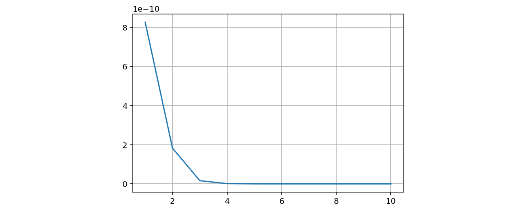
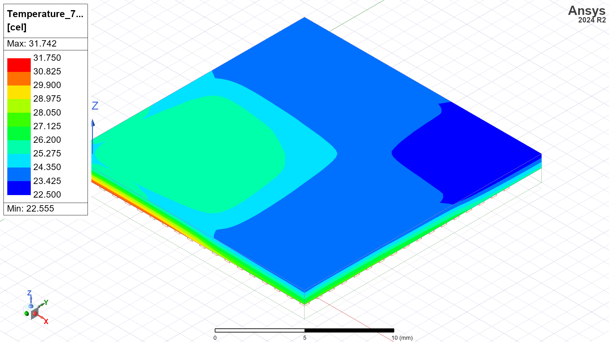

模擬資料擷取與處理
---
這段程式碼的目的是自動化從 ANSYS Icepak 專案中提取並視覺化溫度監控數據與模擬收斂情況，最後還輸出一張顯示模組表面溫度分布的圖片。

它首先載入一個 Icepak 專案，讀取所有可用的監控項目，並擷取這些項目的模擬結果資料，儲存到字典中以供後續分析使用。接著，程式打開模擬過程中的收斂紀錄檔案 Residual.csv，解析每一步的收斂值，並將這些值畫成折線圖，方便檢查模擬是否穩定或已收斂。最後一步是針對名為 molding 的幾何元件產生表面溫度分佈圖，並將此圖輸出為圖片檔案，提供視覺化結果給設計工程師參考。

```python
from ansys.aedt.core import Icepak
icepak = Icepak("C:/demo/chip.aedt")

import matplotlib.pyplot as plt
monitor_temperature = {}
for quantity in icepak.post.available_report_quantities(quantities_category='Monitor'):
    data = icepak.post.get_solution_data(quantity)
    monitor_temperature[quantity] = data.data_real()[0]

print(monitor_temperature)

risidual_path = f"C:/demo/chip.aedtexport/{icepak.design_name}/Setup/Residual.csv"
with open(risidual_path) as f: 
    text = f.readlines()
    
risidual = []
for line in text[1:]:
    number = int(line.split(',')[0])
    value = float(line.split(',')[-1])
    risidual.append((number, value))
x, y = zip(*risidual)
plt.grid()
plt.plot(x, y)

temp_field = icepak.post.create_fieldplot_surface('molding', 'Temperature')
temp_field.export_image('c:/demo/temp.png')
```
#### 收斂曲線


#### 溫度分布
 