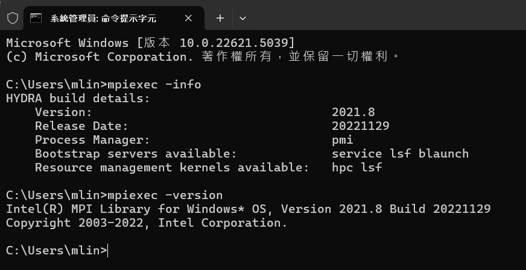
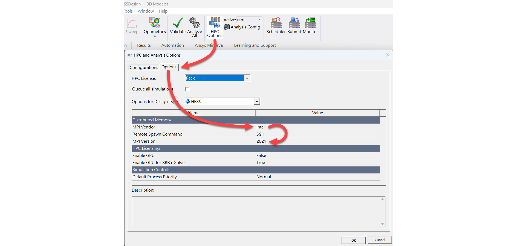

HFSS HPC基本
---
### 1. HFSS HPC模式分類


#### 1. 本地多核 (Local Multicore)
- 單臺電腦上使用多核心進行計算
- 不需安裝 RSM 或 MPI
- 適合中小型題目、單人使用、測試環境
- 運算負載與記憶體集中在單一機器上
- AEDT 中可手動設定 core 數量 (e.g., 4核, 8核)

---

#### 2. 遠端單臺多核 (Remote Solve using RSM)
- 使用 RSM (Remote Solve Manager)依托關聯把作業从 A 送至 B 機器執行
- 類似“A 丟作業給 B”
- A 與 B 之間不同步執行
- 不需 MPI
- 適合對系統有比較強運算能力的遠端機器輸入作業
- RSM 需要裝在主機與遠端機器上，必須允許網路、帳號、密碼通信
- B 註冊 RSM
- A 設定 HPC Options 指向 B
---

#### 3. 分散多核 (Distributed using RSM + MPI)
- 同時使用 RSM 和 MPI 轉達作業到多臺機器
- 類似“A 與 B 一起同步執行”，所有節點同時參與
- 適合解字法大、順於分解解法 (DDM)的 HFSS 分析
- 需每台機器都安裝相同版本的 MPI ，且需設定 MPI 帳號、診斷通信
- mpiexec -n 2 -hosts 2 A-ip B-ip hostname
- 支援分散法包括:
  - 掃頻點 (Frequencies)
  - 組合網格 (Mesh Assembly)
  - HFSS 時執分散 excitations
  - 區域分解法 (DDM)

---

#### HFSS HPC 模式對照表

| 模式             | 適用情境           | 安裝需求     | 並行等級 | 網路需求 |
|----------------------|------------------------|------------------|----------------|-------------|
| 本地多核         | 單人測試、中小型題目 | 無               | 多線程         | 無          |
| 遠端單臺多核     | 作業輸入至遠端機器     | RSM              | 單機多核       | 有          |
| 分散多核         | 同步執行大型分析計算   | RSM + MPI        | 多機多核       | 絕對需      |

### 2. HPC安裝檢查表
#### 安裝與環境

- 所有機器已安裝相同版本 ANSYS EM Suite，包括核心模組與所有必要模擬元件
- 所有機器 ANSYS EM Suite安裝路徑一致
- 各台機器皆已安裝對應之 Service Pack，並已完成更新驗證
- 僅安裝 Intel MPI，未與 Microsoft MPI 或 IBM MPI 混用
- 作業系統帳號具有 Administrator 權限，具備修改服務與網路設置之能力
- 所有電腦使用者帳號與密碼完全一致，包含字元大小寫與網域設定

#### 網路與權限

- 所有機器均在同一區網 (LAN) 或子網段中，能相互解析與通訊
- 使用 PowerShell 命令 Get-NetConnectionProfile 確認網路為已辨識類型（非公用）
- 所有機器之 Windows 防火牆服務已完全停用（包括私人與公用網路設定）
- 所使用之防毒軟體已停用或排除 C:\Program Files\AnsysEM 與 Temp 目錄、相關執行檔與服務
- 所有模擬用 Temp 資料夾設定 Everyone 具讀寫權限，避免寫入錯誤

#### RSM 設定

- Server 與所有 Client 均已完成 與ANSYS EM Suite相同版本之RSM 安裝

- Server 與所有 Client 均已完成 RSM 註冊

- 使用 services.msc 驗證 RSM 服務於所有機器皆為「執行中」狀態

#### Intel MPI 設定

- 透過ANSYS EM Suite安裝軟體安裝Intel MPI 於所有機器（含 Server 與 Client），版本必須完全一致
- 使用系統管理員身份執行 hydra\_service -install 完成安裝流程
- 執行 hydra\_service -start 啟用 Intel MPI 背景服務
- 使用 mpiexec -register 並手動輸入帳號與密碼完成註冊，含網域格式
- 每台機器帳密註冊成功，帳號可於 mpidiag 測試中正確回應，且為目前登入者一致
- 使用 mpidiag -s  -iscached 測試快取狀況，確認每台機器快取皆有效
- HFSS當中切換到對應版本的MPI版本

#### 模擬與提交測試

- 開啟 AEDT，進入 HPC Options 並測試非分散式（單機）作業
- 執行分散式但非 MPI 的案例，例如參數掃描（Optimetrics）或多變數模擬
- 執行需啟動 MPI 的案例，如 HFSS 的 DDM 或具有多 excitation 分佈的模擬設計
- 於 Simulation Profile 中觀察任務於多台機器分配狀況與資源使用率，並確認所有運算節點有正常參與運算


### FAQ

#### 1. 在 Server 上檢查本機 RSM 有無正常啟動
```bash
Get-Process -Id (Get-NetTCPConnection -LocalPort 32958).OwningProcess
```


#### 2. 在 Client 上檢查Server RSM 可否正常連接
```bash
Test-NetConnection -ComputerName 10.72.0.61 -Port 32958
```


#### 3. 檢查本機安裝MPI訊息 

```bash
mpiexec -info
mpiexec -version

```



#### 4. 確定mpi呼叫版本

```bash
mpiexec -version
```

**輸出**
```bash
C:\Users\mlin>mpiexec -version
Intel(R) MPI Library for Windows* OS, Version 2021.8 Build 20221129
Copyright 2003-2022, Intel Corporation.
```

#### 5. 啟動mpi服務

```bash
hydra_service -install
```
**輸出**
```bash
C:\Users\mlin>hydra_service -install
Stopping Intel(R) MPI Library Hydra Process Manager 2021.8.
Intel(R) MPI Library Hydra Process Manager 2021.8 stopped.
Intel(R) MPI Library Hydra Process Manager 2021.8 removed.
Intel(R) MPI Library Hydra Process Manager 2021.8 installed and started.
```


#### 6. 檢查啟動之mpi服務
```bash
Get-Service | Where-Object { $_.Name -like "*hydra*" }
```


#### 6. 檢查mpi連結

```bash
mpiexec -hosts 2 10.72.0.61 1 10.72.0.63 1 hostname
```

**輸出**
```bash
C:\Users\mlin>mpiexec -hosts 2 10.72.0.61 1 10.72.0.63 1 hostname
taitiger01
taitiger03
```

#### HFSS 當中 MPI 設定
